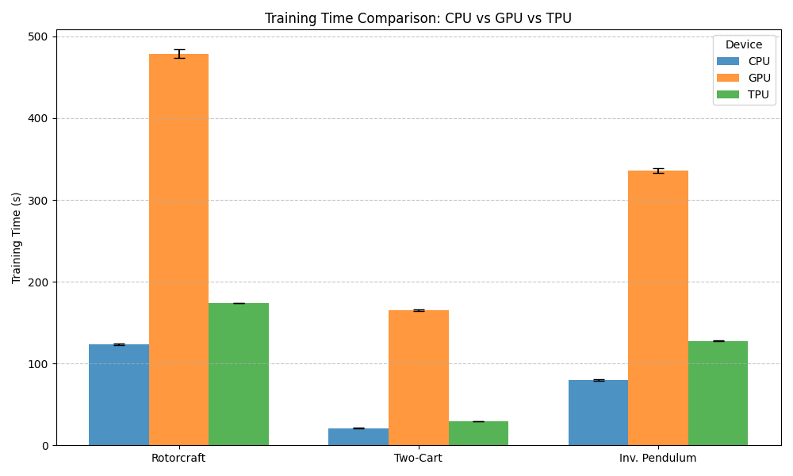
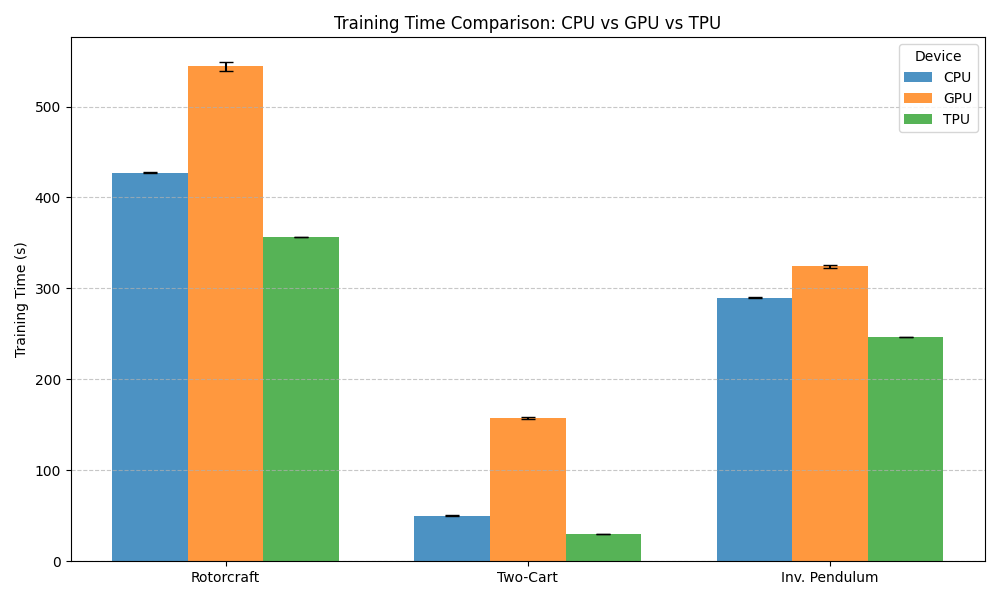

# Execution-Time-Benchmarking-Closed-Loop-ODEs
Compare the Execution time &amp; Training time between TPUs and GPUs for ML by solving Closed-Loop ODEs.
This script returns tuned PID gains along with the required training time.

## Installation

First, ensure you have the common dependencies installed for data visualization and progress tracking:

```bash
pip install tqdm
pip install matplotlib
```

JAX installation depends on your hardware. Please follow the instructions below based on your environment:

for using gpu
```bash
pip install -U "jax[cuda12_pip]"
```

for using tpu
```bash
pip install -U "jax[tpu]"
```

## Usage

Setting desired seed range and number of wind by change the code benchmark_time.py and run it. 
```bash
python benchmark_time.py
```

Then you can get PID gains, training time and compile time for each seed. Please be careful with the name of train_results.
You can also can plotting by
```bash
python plot_benchmarks.py
```
Please note that you have to change the name of folder train_results to train_results_xpu.

## Details

The codebase is organized into four main modules: utils, dynamics, train, and plot. The implementation covers three distinct systems: a planar rotorcraft, an inverted pendulum, and a two-cart system.

The system-specific dynamics are defined in `dynamics.py`, `dynamics_invpend.py`, `dynamics_twocart.py`.

`utils.py` contains essential utility functions, including spline interpolation and an ODE solver based on the Runge-Kutta method.

The training scripts `train_pid.py`, `train_pid_invpend.py`, `train_pid_twocart.py` are responsible for tuning the PID gains and recording the total training time.

## Result

We test two configuration : (seed range 20, M 10), (seed range 5, M 50)

To ensure a fair comparison, we utilized a TPU v5e-1, an NVIDIA L4, and an AMD EPYC 48-core CPU. Both the v5e-1 and L4 target energy-efficient workloads and were released concurrently in 2023.



For the case (seed range: 20, M: 10), training on a GPU shows a higher execution time, taking approximately 2 to 3 times longer than on a TPU. Furthermore, the computational cost of solving ODEs on a TPU is 1.5 to 2 times higher than on a CPU.
Given that solving ODEs is an inherently sequential task, the reduced execution time on the CPU is a predictable outcome. Furthermore, the results demonstrate that the TPU exhibits significantly superior performance compared to the GPU.



For the case (seed range: 5, M: 50), the architecture facilitates the parallel execution of multiple ODE instances through extensive vectorization. Hence, the expected advantage of the TPU in terms of performance was confirmed through the results.

In conclusion, TPUs generally exhibit superior performance compared to GPUs when solving ODEs. Especially in scenarios where vectorization is not utilized, CPUs serve as a viable alternative.

## Reference

This codes are based on `https://github.com/StanfordASL/Adaptive-Control-Oriented-Meta-Learning.git`
